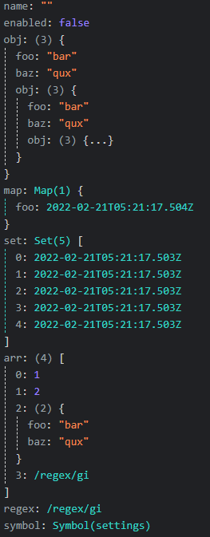

## ⚠️ The `master` branch of the repo will remain unchanged until the end of SolidHack voting! 

## ⚠️ If you would like to see the current progress of this project, please view the [`dev` branch](https://github.com/CompendiumDevTools/library/branch/dev).

## ⚠️ This project is a work in progress and might not be usable at the current time.

A framework-agnostic devtools extension made for SolidHack.

## Features

- [x] Fast rendering of large datasets.
- [x] Live updating.
- [x] Per-page functionality.
- [ ] Readable and collapsible node tree view.
- [x] Readable and collapsible state tree view.
- [x] Extensible and fast serializing of any type with flexible display options.
- [ ] Globally tracked history.
- [ ] State-scoped tracked history.
- [ ] State stacktrace viewer.
- [ ] State diff viewer.
- [ ] State-scoped code executor.

## Previews
  
The following is an old video of the UI since the UI is still being built.

https://user-images.githubusercontent.com/40003440/162802430-4fa480a4-e6b4-445e-b475-53a6832be6cf.mp4

The state tree displayed in the video now looks like this:



In the next video, the Solid connector is being used on a basic page to observe changes in the components and signals and send them to the currently unfinished devtools panel.

https://user-images.githubusercontent.com/40003440/162839893-3d234efa-8242-475e-939a-5fdd60dadb21.mp4

## How It Works

First of all, it's of course not possible for Compendium DevTools to work with *every* framework. It's designed to be as flexible as possible, but some frameworks might simply be impossible to connect to because of how they work.

"Nodes" are the term for any piece of data that can be tracked by the devtools. This could be UI components, stores (like `useState` from React or `createSignal` from Solid), or any other data you wish. As long as you connect them to the devtools, they will appear in the devtools and be tracked like anything else.

Because such a wide range of data is possible, the devtools is designed to be extensible and flexible in how the data can be displayed. You can set custom names and colors for everything to make it easier to find what you're looking for.

Nodes are displayed in the devtools as a tree. Each node has static options (such as the ID, and tracking options) and dynamic data (such as the state, name, and children).

Whenever a node is updated, the devtools will save the current dynamic data of all nodes into a global history which can be seeked through, as well as the individual history of each node, and update the node tree accordingly. You will be able to see exactly how many times your nodes are updating, when, why, and what the current state is.

## Building From Source

Currently there are only instrcutions to run the dev environment from source.

```bash
pnpm i 
pnpm run dev
cd ./src/ui
pnpm i
cd ../..
pnpm run dev-ui
# Copy the manifest.json into the ./dist directory.
```

Next you can either run a blank test environment with `web-ext` or import the extension to your browser.

If you want to do the former, just run this command:

```bash
pnpm run dev-start
```

If you do the latter, you need to enable developer mode in the browser's extension page before you can import it.
